# GenBank-LLM
GenBank-LLM is a specialized LLM designed to analyze data from documents containing nucleotide sequences, amino acid sequences, and annotations, such as those found in GenBank format data, by employing natural language processing techniques for advanced biological data analysis. The aim is to create an LLM that can understand both sequence data and natural language data.

## Building a model
### 1. 비정형 텍스트 데이터베이스에서 정보 추출 및 문서 파편화 작업
<p align="center">
  
</p>

### 2. 저수준 문서들을 조합하여 고수준 문서를 생성, 평가, 삭제, 보존 작업
<p align="center">
  
</p>

### 3. Instruction-following 모델 학습을 위한 데이터세트 생성 작업
<p align="center">
  
</p>

### 4. 생성된 데이터세트를 사용하여 모델 학습(pre-trianing or fine-tuning)
<p align="center">
  
</p>

## Usage
```

```

# Reference
- App baseline & Natural Language to Knowledge Graph: [GraphGPT](https://github.com/varunshenoy/GraphGPT)
- ChatGPT retrieval plugin: [chatgpt-retrieval-plugin](https://github.com/openai/chatgpt-retrieval-plugin)
- Auto-GPT [Significant-Gravitas/Auto-GPT](https://github.com/Significant-Gravitas/Auto-GPT)